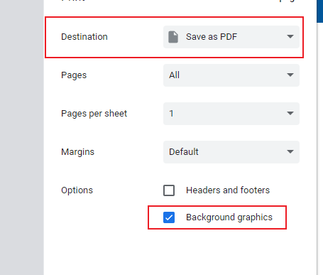
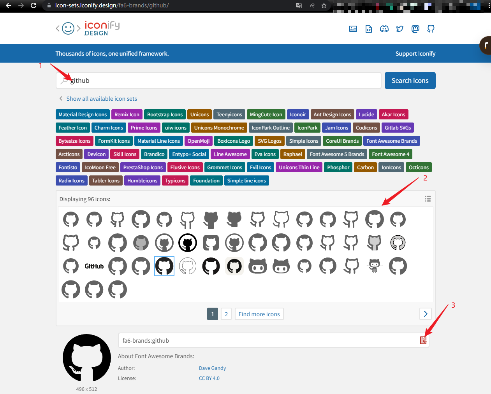

# Simple Resume
<p align="center">
  <a href="https://github.com/evankwolf/simple-resume/blob/main/README.en.md"></a>
</p>

## 项目介绍
一个简单的纯前端简历生成器，不会搜集你的任何数据，也没有任何后端请求。所以改动均保存在 `localStorage` 。可以在下面的网址体验

<a style="font-size: 16px;" href="https://evankwolf.github.io/simple-resume/" target="_black">项目地址</a>

## 使用方法
使用内容和样式编辑器去动态编辑自己的简历，然后点击 `导出PDF` 后，在浏览器弹出的窗口中选择 `保存为PDF/Save as pdf` 即可。

记得要勾选上 `背景图像/Background graphics`，这样才能保证背景颜色正常生效。




## 感谢
### 想法来源
最初是因为自己想要写简历，于是在Github上面找开源的简历生成器，然后发现了两个我觉得非常好用的。

1. [Visky/resume](https://github.com/visiky/resume)
2. [AmruthPillai/Reactive-Resume](https://github.com/AmruthPillai/Reactive-Resume)

这两个项目都很好用，我觉得已经能满足大部分需求了，只是我在使用后者的过程中发现项目描述过长时会使得日期文字被挤压，使用前者时则会希望能够多点自定义选项。所以又开始了无穷无尽地寻找之旅。

在经历了

1. 需要注册/登录
2. 需要纯自己手动排版写md
3. 需要手动对docs格式的模板排版
4. ...

之后，我决定自己写一个（笑）

因为我喜欢简历排版简单点，所以这个项目也没有什么复杂的排版。

以上です。

### 依赖
非常感谢下面的这些开源库和贡献者，是他们让我的这次开发体验无比愉快与轻松。

- [React](https://react.dev/)
- [Vite](https://vitejs.dev/)
- [Zustand](https://github.com/pmndrs/zustand)
- [Iconify](https://iconify.design/)
- [Ant-design](https://ant.design/)
- [Typescript](https://github.com/microsoft/TypeScript/)
- [Unocss](https://unocss.dev/)
- [react-i18n](https://react.i18next.com/)
- [react-markdown](https://github.com/remarkjs/react-markdown)
- [gh-pages](https://github.com/tschaub/gh-pages)
- [html2pdf.js](https://github.com/eKoopmans/html2pdf.js)
- [react-to-print](https://github.com/gregnb/react-to-print)
- [Husky](https://github.com/typicode/husky)

## 常见问题
### 1. 我能复制别人写好的简历吗？
可以的，让你的朋友先在本地选择 `导出配置` 之后将json文件发给你，你再选择 `导入配置` 就可以了

### 2. Icon是在哪里找的？
可以直接去到 [Iconify Icons](https://icon-sets.iconify.design/)进行搜索，然后复制对应的代码过来就好了。


## 本地运行
克隆/下载本项目代码到本地，然后运行下面的指令（强烈建议使用Pnpm）

### Install dependencies
```bash
pnpm install
```

### Development
```bash
pnpm dev
```

### Build
```bash
pnpm build
```

### Deploy on your GitHub pages
```bash
pnpm publish
```

